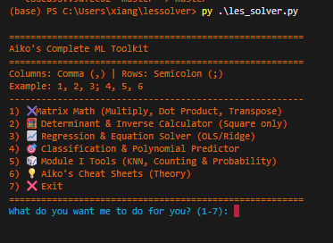
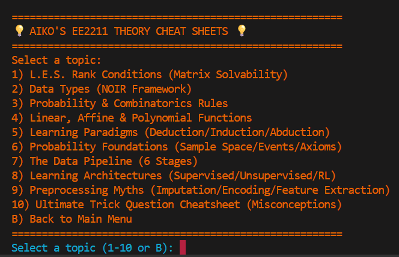
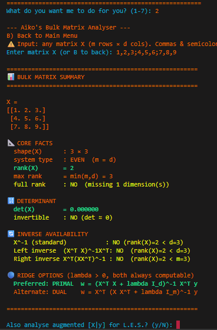
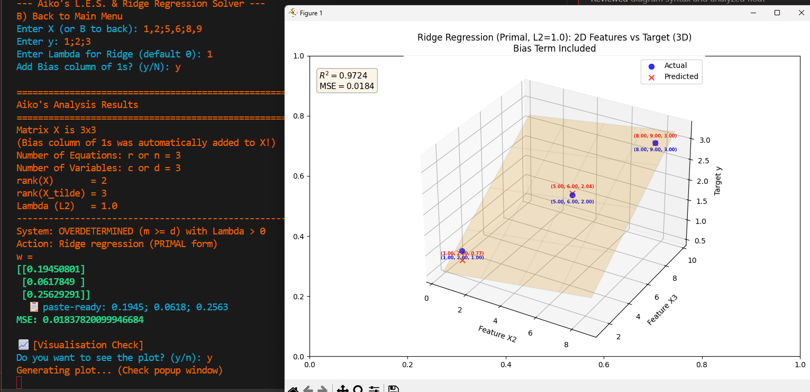
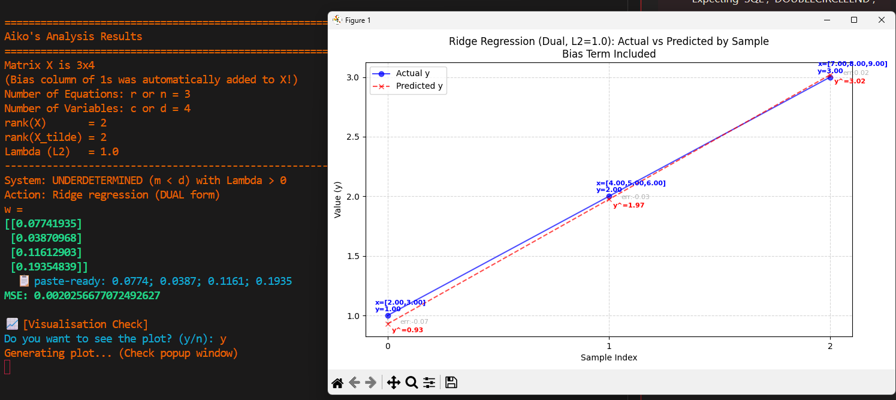
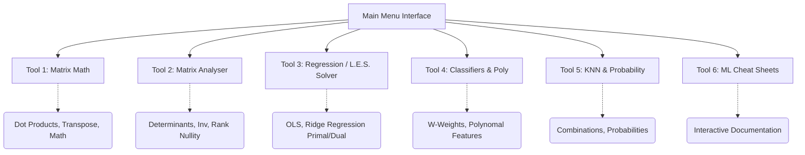
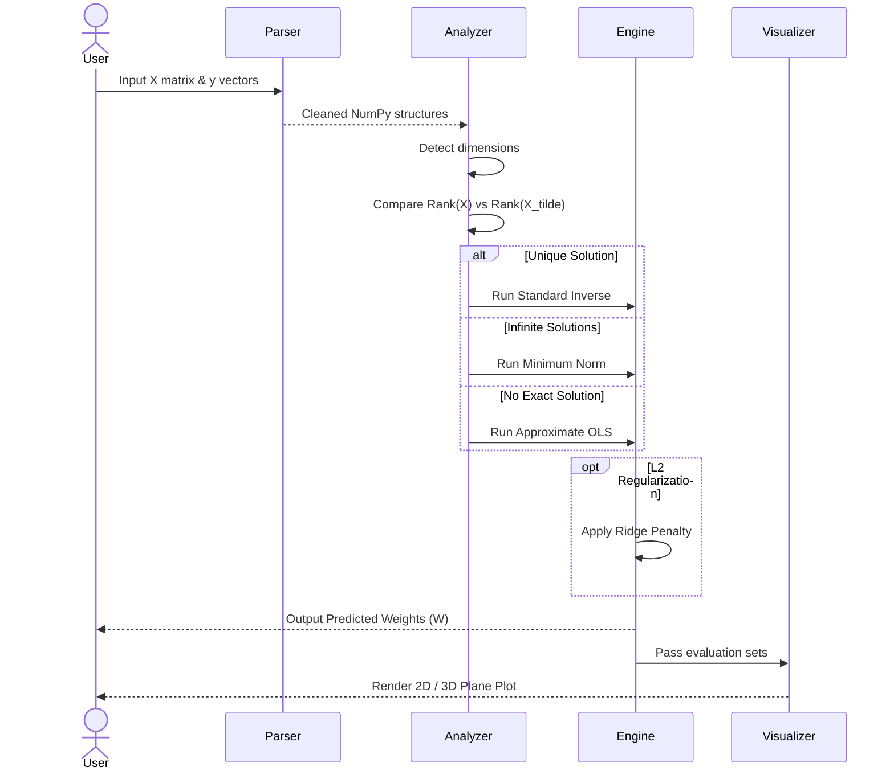
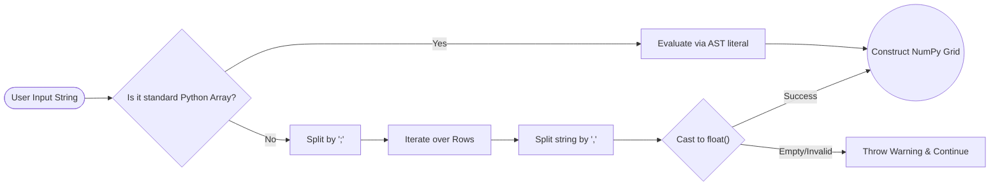

# Complete ML Toolkit (LES Solver)

A comprehensive Python-based Command-Line Interface (CLI) interactive toolkit for exploring Linear Algebra, Probabilities, Machine Learning Principles, and Linear Equation Systems (L.E.S.). The tool functions as an intelligent computational assistant to parse, validate, solve, and visualize complex matrix-related problems.

---

## � Demo & Visualizations

  
    
  
<em>Main Menu Interface & Interactive Cheatsheets</em>

  
  
  
<em>Matrix Solvability Analysis & Engine</em>

  
  
  
  
<em>Matplotlib 2D and 3D Model Rendering</em>

---

## �🛠️ Skills Used

*   **Matrix Algebra & Computational Mathematics:** Deep handling of matrix manipulations (Multiplication, Dot Products, Transposes), Left/Right Pseudo-inverses, Rank computing, and Determinants.
*   **Machine Learning (Regression & Classification):** Implementing Ordinary Least Squares (OLS), Ridge Regression (Primal and Dual forms with L2 normalization), and Multi-Class Classification (One-hot encodings / One-vs-All logic).
*   **Combinatorics & Probability Engine:** Managing permutations, combinations, multisets, Stars & Bars, conditional probability, Bayes theorem, and disjoint events.
*   **Distance Metrics & Search:** Calculating Euclidean (L2) and Manhattan (L1) distances with dynamic K-Nearest Neighbors (KNN) logic.
*   **Data Serialization & Parsing:** Transforming user-provided MATLAB-style string representations (`1,2; 3,4`) directly into structured NumPy multi-dimensional arrays.
*   **Advanced Data Visualization:** Creating conditional plotting algorithms using `matplotlib` to render multi-dimensional datasets, regression lines, and 3D mesh surface planes mapping Actual vs. Predicted values.
*   **CLI UX/UI Design:** Using `colorama` to color-code inputs, results, and warnings sequentially across hierarchical application menus.

---

## 📚 Topics Covered

1.  **System of Linear Equations (L.E.S.) Solvability Analysis:** Analyzing and solving Even, Overdetermined, and Underdetermined systems via matrix rank equivalence versus augmented matrices (`[X | y]`).
2.  **Regularization Methods:** Injecting $\lambda$ weights into Ridge Regression optimizations for edge-case numerically unstable matrix inversions. 
3.  **Polynomial Feature Expansion:** Extending features to explicit polynomial degrees and verifying feature permutations algorithmically. 
4.  **Mathematical Theory & Logic Paradigms:** Dedicated interactive cheat sheets explaining NOIR framework definitions, learning paradigms (Deduction vs Induction), data imputation, classification structures, and dimensionality bounds.
5.  **Performance Evaluation:** Granular outputs for overall and per-column Mean Squared Errors (MSE) evaluating the strength of predictive algorithms against validation metrics.

---

## 🏛️ System Architecture

### 1. High-Level Modular Design

### 2. Regression & Solvability Engine Pipeline
The sequence of mathematical deduction the system follows when evaluating a set of linearly mapped data targets.

### 3. Data Processing & Input Parsing Logic

